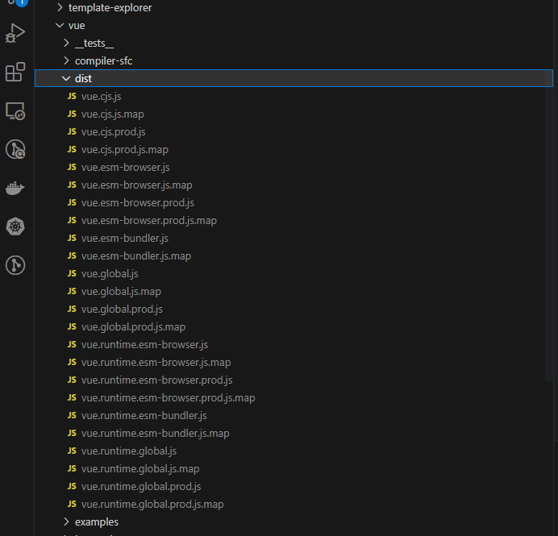

# 调试

## 确定vue3的具体版本

在开始之前我们需要确定使用的`vue3`的版本，这里的版本指的是小版本，很重要，会和后面的`sourcemap`一一对应。我这里选择的是`3.3.4`。将上文中clone到本地的源码`reset`到对应的版本

```shell
git reset --hard v3.3.4
```

## 打包出带有sourcemap的版本

`vue3`的源码使用`rollup`打包，根据`rollup`的配置直接使用以下命令打包

```shell
pnpm build -s
```

打包出的代码位于`packages/vue/dist`文件夹下，带有`sourcemap`文件



这里为了方便使用已经上传了[cdn](https://www.jsdelivr.com/package/npm/xiaochuan-vue3-source?tab=files&path=dist%2F3.3.4)

## 引入

引入有两种方式
