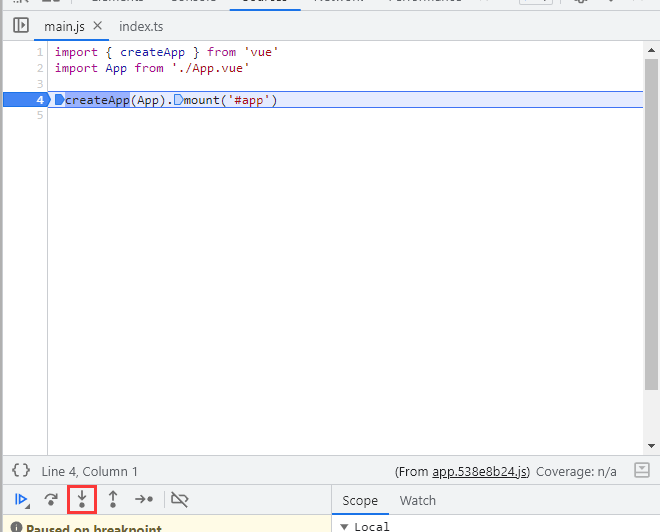
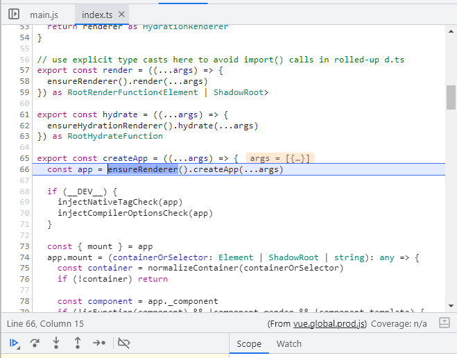

# 调试

## 调试准备

调试源码需要用到`chrome devtools`的`断点`以及`performance record`

## 确定vue3的具体版本

在开始之前我们需要确定使用的`vue3`的版本，这里的版本指的是小版本，很重要，会和后面的`sourcemap`一一对应。我这里选择的是`3.3.4`。将上文中clone到本地的源码`reset`到对应的版本

```shell
git reset --hard v3.3.4
```

> 本项目使用的vue版本为`3.3.4`

## 打包出带有sourcemap的版本

`vue3`的源码使用`rollup`打包，根据`rollup`的配置直接使用以下命令打包

```shell
pnpm build -s
```

打包出的代码位于`packages/vue/dist`文件夹下，带有`sourcemap`文件


这里为了方便使用已经上传了[cdn](https://www.jsdelivr.com/package/npm/xiaochuan-vue3-source?tab=files&path=dist%2F3.3.4)

## 引入

引入有两种方式

### webpack externals

使用`webpack` external掉`vue`然后再通过全局引入`Vue`变量，这里全局引入的`Vue`是我们之前打包好的带有`sourcemap`的。这里引入的是`production`的打包，所以调试的时候不能使用`serve`命令，需要先把`production`模式下的产物输出在通过`serve dist`进行调试，这样可以省略到很多在`production`模式下不需要的代码比如`hmr`。当然如果想在`development`模式下调试的话可以引入`develeopment`模式下的`Vue`。

后续引入的`vue`都是`production`模式下的。

使用`@vue/cli`创建的项目可以直接修改`webpack`的配置

```js title="vue.config.js"
/**
 * @type {import('@vue/cli-service').ProjectOptions}
 */
const config = {
  configureWebpack: {
    externals: {
      vue: 'Vue',
    },
  },
};

module.exports = config;
```

```diff title="public/index.html"
<!DOCTYPE html>
<html lang="">
  <head>
    <meta charset="utf-8">
    <meta http-equiv="X-UA-Compatible" content="IE=edge">
    <meta name="viewport" content="width=device-width,initial-scale=1.0">
    <link rel="icon" href="<%= BASE_URL %>favicon.ico">
    <title><%= htmlWebpackPlugin.options.title %></title>
+ <script src="https://cdn.jsdelivr.net/npm/xiaochuan-vue3-source@0.0.5/dist/3.3.4/vue.global.prod.js"></script>
  </head>
  <body>
    <noscript>
      <strong>We're sorry but <%= htmlWebpackPlugin.options.title %> doesn't work properly without JavaScript enabled. Please enable it to continue.</strong>
    </noscript>
    <div id="app"></div>
    <!-- built files will be auto injected -->
  </body>
</html>
```

运行下面命令就能断点到源码里面了

```shell
pnpm build
pnpm start
```

在浏览器里面我们把断点打到`main.js`的`createApp`那行，断点生效后点击`step into`(图1左下角)跳进函数声明，可以看到图2以及正确跳进了`vue3`的源码的`createApp`函数声明里面





webpack external方式的源码位于[examples/demo-webpack](https://github.com/2239559319/profient-vue3/tree/master/examples/demo-webpack)
