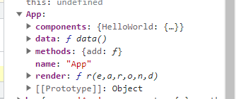
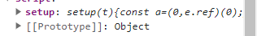
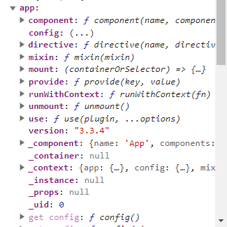
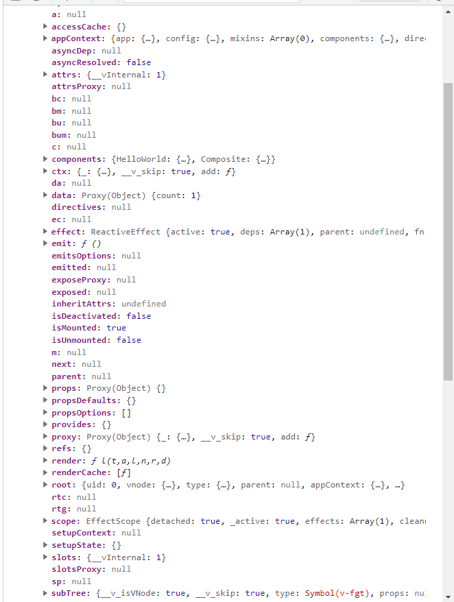
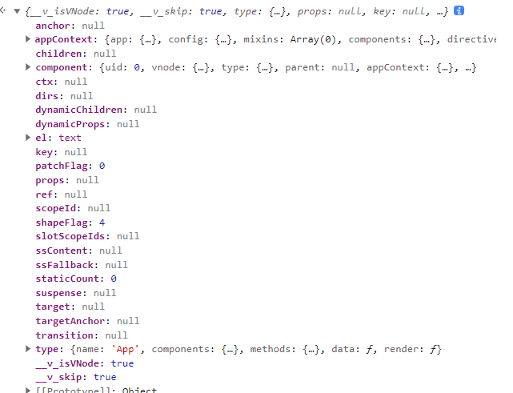

# 基本数据结构

## component

常说的组件是`import HelloWorld from './helloworld.vue'`中的`HelloWorld`。在使用`webpack`和`vue-loader`时，这里导入的组件会被`vue-loader`自动处理。对于`Options API`的组件来讲，这里以demo中的`App.vue`来讲，具有以下结构

对于`composite setup`的组件来讲，具有一下结构

总结起来就是`component`是经过编译器处理后得到的产物。具有一定结构

## app

一个`app`是createApp函数的返回值，第一个参数是根组件。第二个参数可选，它是要传递给根组件的 props。根组件就是上面所说的`component`

app具有以下结构

## component instance

`component instance`表示在运行过程中创建好的`component`，和`component`的区分是`component`只是编译后的一个对象，这个对象不需要`vue`的创建就可以单独存在，而`component instance`是`vue`在渲染过程中创建的内部对象，用以渲染的用途

`component instance`具有以下结构

## vnode

这个不多讲官网文档里面有。`vnode`是渲染算法的核心结构。`type=component`的`vnode`具有以下结构

> vnode还有其他很多种结构这里不列出

## container

`app.mount`函数的第一个参数是`container`

## 依赖图

对于`type=component`的`vnode`来讲，以上数据结构具有如下的关系
