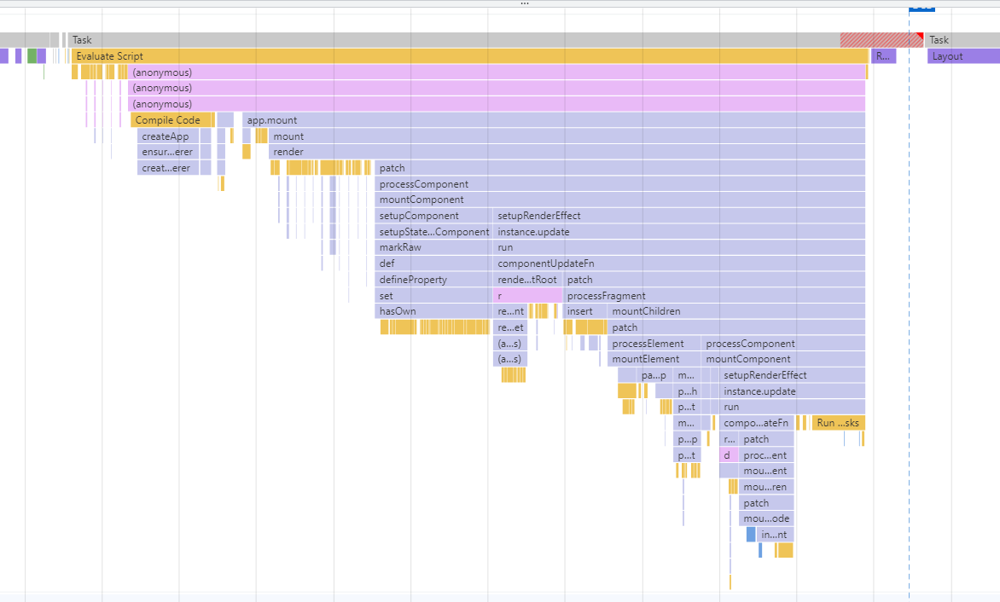

# 运行概述

## 首次渲染

火焰图

从图中可以看出第一次渲染主要分为两步

1. 创建`app`对象
2. 手动调用对象的`mount`方法

`mount`函数是第一次渲染的调用的函数，从图中可以看到`mount`函数会调用`render`函数，`render`函数的核心是`patch`函数。

这里先给出结论，`vue`的渲染实际上是递归调用`patch`函数进行`深度优先遍历`直到完成渲染。

## 非首次渲染

> 图1左边部分位于图2的红色框区域

从图中可以看到非首次渲染也分为两部分

1. 触发更新
2. 执行更新

执行更新的函数调用时处于一个微任务调用栈里面（图2的`run MircoTasks`）。

之后调用的核心函数是`componentUpdateFn`，这个函数在之后也会调用`patch`方法去递归遍历进行渲染

## 总结

`vue3`的渲染无论是首次还是非首次核心都是递归调用`patch`算法进行深度优先遍历进行渲染
